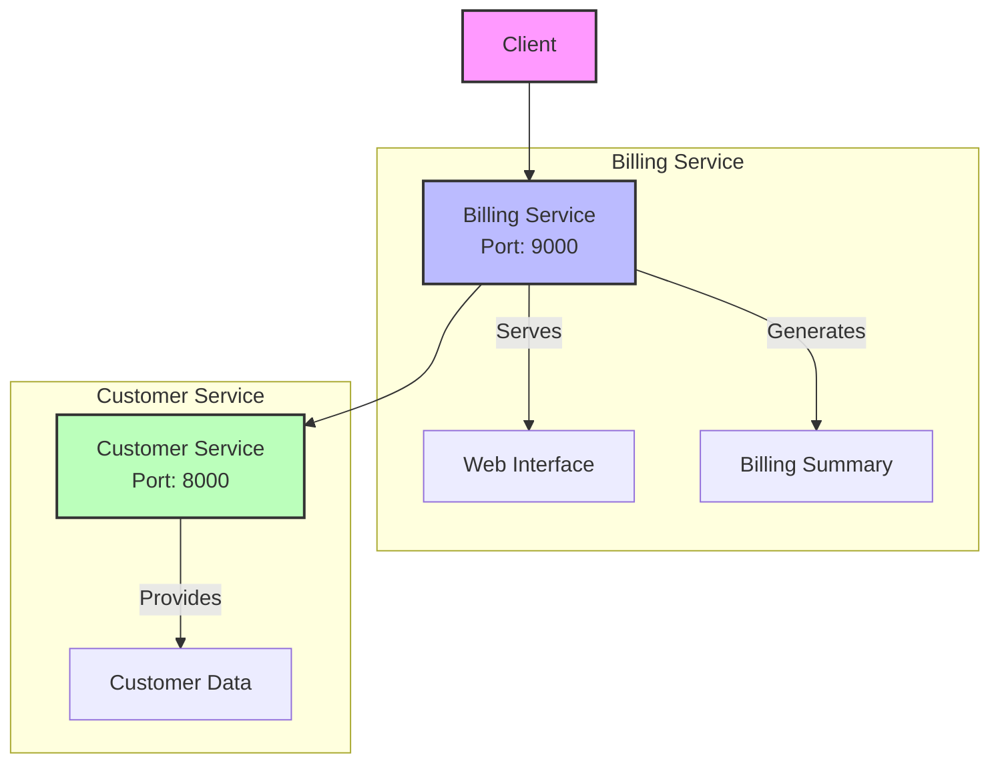

# Microservices Demo: Billing and Customer Services

This repository contains a microservices-based application that demonstrates the interaction between a Billing Service and a Customer Service. The application is built using Node.js and Express.js, showcasing a basic implementation of microservices architecture.

## Architecture Overview



## Services Description

### Customer Service
- **Port**: 8000
- **Functionality**: Provides customer information through a REST API
- **Endpoints**:
  - `GET /api/customer`: Returns customer details (id, name, email)

### Billing Service
- **Port**: 9000
- **Functionality**: Generates billing summaries by combining customer data with billing information
- **Endpoints**:
  - `GET /`: Serves the web interface
  - `GET /api/billing`: Generates a billing summary by fetching customer data and adding billing details

## Setup and Installation

### Prerequisites
- Node.js (Latest LTS version recommended)
- npm (Comes with Node.js)

### Installing Customer Service
1. Navigate to the customer-service directory:
   ```bash
   cd customer-service
   ```
2. Install dependencies:
   ```bash
   npm install
   ```
3. Start the service:
   ```bash
   node customerService.js
   ```

### Installing Billing Service
1. Navigate to the billing-service directory:
   ```bash
   cd billing-service
   ```
2. Install dependencies:
   ```bash
   npm install
   ```
3. Start the service:
   ```bash
   node billingService.js
   ```

## API Documentation

### Customer Service API
#### GET /api/customer
Returns customer information.

Response example:
```json
{
    "id": 1,
    "name": "Alice Johnson",
    "email": "alice@example.com"
}
```

### Billing Service API
#### GET /api/billing
Returns a combined billing summary with customer information.

Response example:
```json
{
    "id": 1,
    "name": "Alice Johnson",
    "email": "alice@example.com",
    "customerId": 1,
    "amountDue": "$150",
    "dueDate": "2025-02-28"
}
```

## Technical Stack
- **Runtime Environment**: Node.js
- **Framework**: Express.js
- **HTTP Client**: Axios (for service-to-service communication)
- **Static File Serving**: Express.static middleware

## Configuration
- Customer Service runs on port 8000
- Billing Service runs on port 9000
- Services communicate via HTTP REST APIs
- Billing Service expects Customer Service to be available at http://192.168.56.5:8000

## Error Handling
- The Billing Service implements error handling for failed customer service requests
- HTTP 500 status codes are returned with appropriate error messages in case of failures

## Future Improvements
1. Add authentication and authorization
2. Implement database integration
3. Add logging and monitoring
4. Implement service discovery
5. Add containerization support (Docker)
6. Implement API versioning
7. Add test cases

## Contributing
Feel free to submit issues and enhancement requests.

## License
[MIT License](LICENSE)